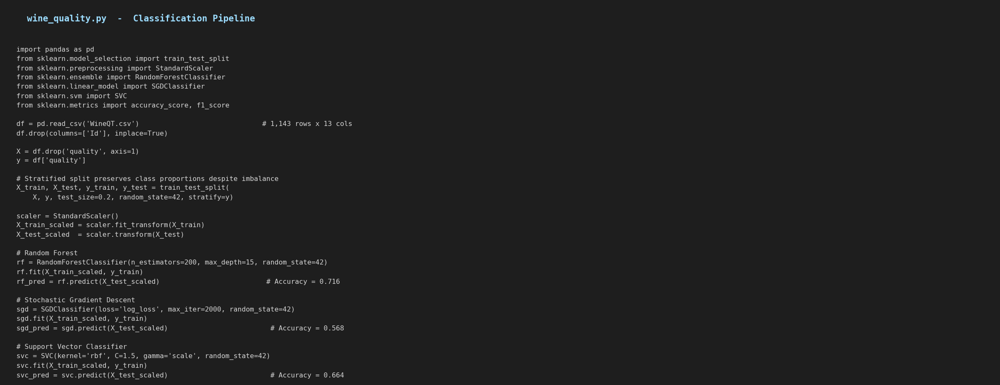
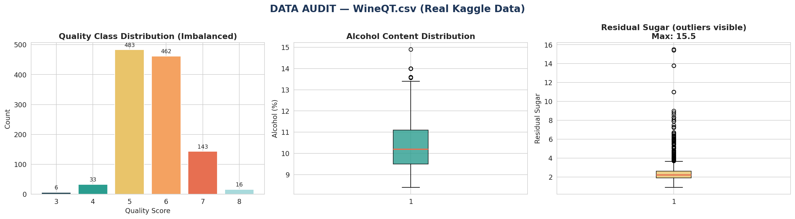
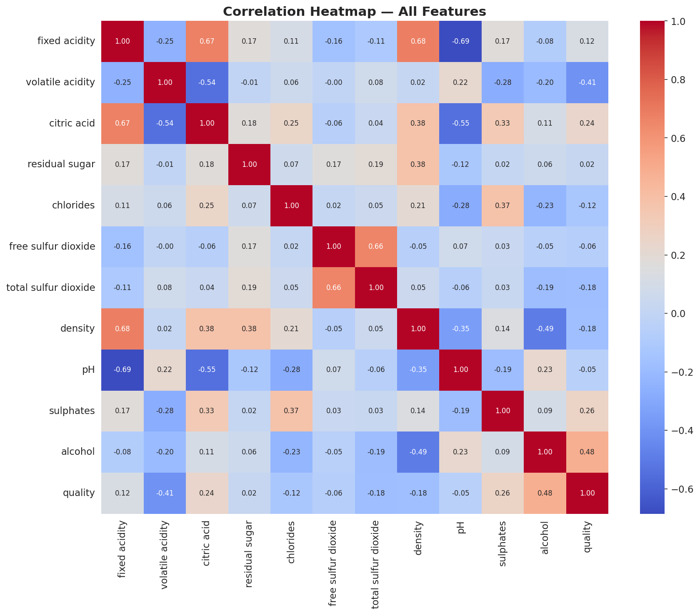
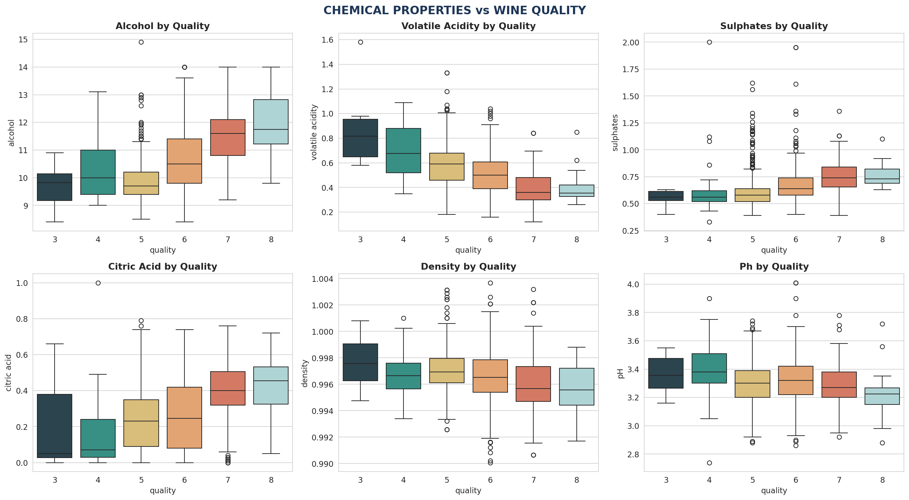
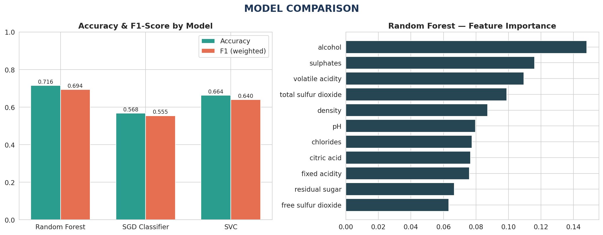
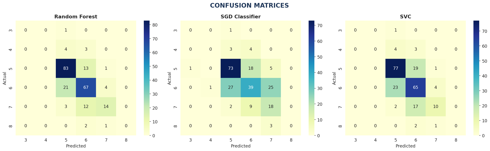

# Wine Quality Prediction
### Project 2 Proposal — Level 2 | Data Analytics



> **Dataset:** Wine Quality Dataset (Red "Vinho Verde" variant) — WineQT.csv
> **Records:** 1,143 wine samples, 11 chemical features + quality target
> **Tools:** Python, Pandas, NumPy, Matplotlib, Seaborn, Scikit-learn

---

## Table of Contents
1. [Problem Statement](#1-problem-statement)
2. [Dataset Description](#2-dataset-description)
3. [Data Inspection](#3-data-inspection)
4. [Exploratory Data Analysis](#4-exploratory-data-analysis)
5. [Data Preparation](#5-data-preparation)
6. [Classifier Models](#6-classifier-models)
7. [Model Evaluation](#7-model-evaluation)
8. [Results & Interpretation](#8-results--interpretation)
9. [How to Reproduce](#9-how-to-reproduce)

---

## 1. Problem Statement

The focus of this project is predicting the quality of red wine based on its chemical characteristics, offering a real-world application of machine learning in the context of viticulture. The dataset encompasses diverse chemical attributes, including density and acidity, which serve as the features for three distinct classifier models.

**Objectives:**
- Understand the dataset and clean it where required
- Build classification models to predict wine quality (scored 0–10)
- Compare evaluation metrics across Random Forest, Stochastic Gradient Descent, and Support Vector Classifier

---

## 2. Dataset Description

This dataset is related to red variants of the Portuguese "Vinho Verde" wine. It describes the amount of various chemicals present in wine and their effect on its quality. The target classes are ordered and imbalanced — there are far more average-quality wines (5, 6) than excellent or poor ones (3, 8).

| Feature | Description |
|---|---|
| `fixed acidity` | Non-volatile acids in wine |
| `volatile acidity` | Acetic acid content (too high → vinegar taste) |
| `citric acid` | Adds freshness and flavor |
| `residual sugar` | Sugar remaining after fermentation |
| `chlorides` | Salt content |
| `free sulfur dioxide` | Prevents microbial growth and oxidation |
| `total sulfur dioxide` | Total SO2, free + bound |
| `density` | Density of the wine |
| `pH` | Acidity level (0–14 scale) |
| `sulphates` | Wine additive contributing to SO2 levels |
| `alcohol` | Percentage alcohol content |
| `quality` | **Target** — score between 0 and 10 (based on sensory data) |

---

## 3. Data Inspection

```python
df = pd.read_csv('WineQT.csv')
df.shape           # (1143, 13)
df.isnull().sum()  # all zero — no missing values
```

The dataset has no missing values. An `Id` column (a row identifier with no predictive value) was dropped before modeling.

### Class Imbalance



| Quality Score | Count | % of Data |
|---|---|---|
| 3 | 6 | 0.5% |
| 4 | 33 | 2.9% |
| 5 | 483 | 42.3% |
| 6 | 462 | 40.4% |
| 7 | 143 | 12.5% |
| 8 | 16 | 1.4% |

The dataset is heavily skewed toward quality scores 5 and 6, which together make up over 82% of all samples. Scores 3, 4, and 8 are rare, which makes them difficult for any classifier to learn reliably — this is flagged here because it materially affects the results in Section 7.

---

## 4. Exploratory Data Analysis

### Correlation with Quality



| Feature | Correlation with Quality |
|---|---|
| alcohol | **+0.485** |
| sulphates | +0.258 |
| citric acid | +0.241 |
| fixed acidity | +0.122 |
| residual sugar | +0.022 |
| pH | -0.052 |
| free sulfur dioxide | -0.063 |
| chlorides | -0.124 |
| density | -0.175 |
| total sulfur dioxide | -0.183 |
| volatile acidity | **-0.407** |

**Alcohol** has the strongest positive correlation with quality, while **volatile acidity** has the strongest negative correlation — higher acetic acid content is associated with lower-rated wines.

### Chemical Properties by Quality Class



- Higher-quality wines (7, 8) consistently show **higher alcohol content** and **lower volatile acidity**
- **Sulphates** trend upward with quality, supporting their known role as a preservative associated with better-rated wines
- **Citric acid** is also higher in better-rated wines, consistent with its role in adding freshness
- **pH and density** show comparatively weak, less consistent relationships with quality

---

## 5. Data Preparation

```python
X = df.drop('quality', axis=1)
y = df['quality']

X_train, X_test, y_train, y_test = train_test_split(
    X, y, test_size=0.2, random_state=42, stratify=y)
```

A stratified 80/20 split was used to preserve the original class proportions in both the training and test sets — important given the imbalance noted above.

Features were standardized using `StandardScaler` since SVC and SGD are both distance/gradient-sensitive algorithms that perform poorly on unscaled data:

```python
scaler = StandardScaler()
X_train_scaled = scaler.fit_transform(X_train)
X_test_scaled  = scaler.transform(X_test)
```

---

## 6. Classifier Models

Three classifier models were trained and compared, as specified in the project brief.

### Random Forest Classifier
```python
rf = RandomForestClassifier(n_estimators=200, max_depth=15, random_state=42)
rf.fit(X_train_scaled, y_train)
```

### Stochastic Gradient Descent Classifier
```python
sgd = SGDClassifier(loss='log_loss', max_iter=2000, random_state=42)
sgd.fit(X_train_scaled, y_train)
```

### Support Vector Classifier
```python
svc = SVC(kernel='rbf', C=1.5, gamma='scale', random_state=42)
svc.fit(X_train_scaled, y_train)
```

---

## 7. Model Evaluation



| Model | Accuracy | F1-Score (weighted) |
|---|---|---|
| **Random Forest** | **0.716** | **0.694** |
| SVC | 0.664 | 0.640 |
| SGD Classifier | 0.568 | 0.555 |

Random Forest performed best on both metrics, which is expected given its ability to capture non-linear interactions between chemical features without requiring careful tuning.

### Feature Importance (Random Forest)

The same figure above shows alcohol, sulphates, and volatile acidity as the most important predictors according to the Random Forest model — consistent with the correlation analysis in Section 4.

### Confusion Matrices



All three models predict the majority classes (5 and 6) reasonably well, but **none of them correctly classify any samples in the minority classes (3, 4, 8)** — every model collapses these rare wines into the more common neighboring quality scores. This is a direct consequence of the severe class imbalance documented in Section 3, not a flaw specific to any one algorithm.

### Per-Class Performance (Random Forest)

| Quality | Precision | Recall | F1-Score | Support |
|---|---|---|---|---|
| 3 | 0.00 | 0.00 | 0.00 | 1 |
| 4 | 0.00 | 0.00 | 0.00 | 7 |
| 5 | 0.74 | 0.86 | 0.79 | 97 |
| 6 | 0.69 | 0.73 | 0.71 | 92 |
| 7 | 0.70 | 0.48 | 0.57 | 29 |
| 8 | 0.00 | 0.00 | 0.00 | 3 |

---

## 8. Results & Interpretation

- **Random Forest is the strongest of the three models** at 71.6% accuracy, outperforming SVC (66.4%) and SGD (56.8%)
- **Alcohol content and volatile acidity are the two most predictive features** across both the correlation analysis and Random Forest's feature importances
- The dataset's **severe class imbalance** is the dominant factor limiting performance on minority quality scores (3, 4, 8) — with only 1–7 samples in the test set per minority class, no model has enough examples to learn their patterns reliably
- For practical use, the model is most reliable for distinguishing "average" wines (quality 5–6) from "good" wines (quality 7), which together cover the vast majority of real-world samples

### Limitations & Possible Improvements
- Techniques such as SMOTE (oversampling minority classes) or class-weighted loss functions could improve recall on rare quality scores
- Hyperparameter tuning via `GridSearchCV` was not exhaustively performed here and could likely improve all three models further
- Treating this as a regression problem (since quality is ordinal) or collapsing quality into 3 broader bins (low/medium/high) are both reasonable alternative framings that could yield more stable results given the sample sizes involved

---

## 9. How to Reproduce

```bash
pip install pandas numpy matplotlib seaborn scikit-learn
python wine_quality.py
```

### Requirements

```
pandas>=1.5.0
numpy>=1.23.0
matplotlib>=3.6.0
seaborn>=0.12.0
scikit-learn>=1.1.0
```

### Repository Structure

```
wine-quality-prediction/
|-- README.md                  <- This report
|-- wine_quality.py             <- Full classification pipeline
|-- WineQT.csv                  <- Raw dataset (1,143 rows)
|-- figA_audit.png              <- Class distribution and outlier audit
|-- figB_correlation.png        <- Correlation heatmap
|-- figC_eda.png                <- Chemical properties vs quality
|-- figD_comparison.png         <- Model accuracy/F1 comparison + feature importance
|-- figE_confusion.png          <- Confusion matrices for all 3 models
|-- figF_code.png               <- Pipeline code summary
|-- requirements.txt
```
